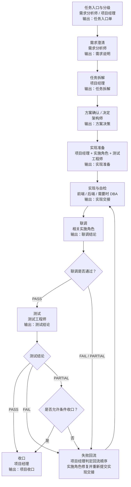
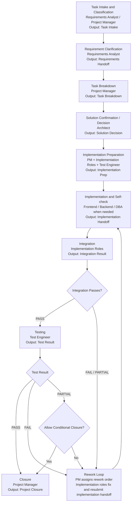

# Harness Engineering 通用治理 Skill 包

[中文](#zh-cn) | [English](#en)

<a id="zh-cn"></a>

这个仓库提供一套平台无关的治理规则，用来约束 AI 参与的软件研发过程。

它不替代需求、设计、开发、测试、安全、数据库等角色本身，而是回答下面这些问题：
- 这项任务现在属于什么级别
- 哪些角色必须参加
- 什么时候可以继续
- 什么时候必须停下
- 每一步至少要留下什么书面结果
- 在什么条件下才能说“已经完成”

## 适用场景

适合这些场景：
- 多智能体协作研发
- AI 编程平台的流程治理
- 内部软件研发规范
- 需要把“谁能做什么、做到哪一步算过关”写清楚的团队

不依赖某一个具体平台，重点是把规则写成任何平台都能映射的形式。

## 仓库内容

- `skills/harness-governance/SKILL.md`
  - 总控入口
  - 用来判断任务级别、参与角色、门禁、交接和完成条件

- `skills/*/SKILL.md`
  - 独立角色 Skill
  - 用来约束各个角色该拿什么、该产出什么、什么时候必须停下

- `docs/01_平台无关约束原则.md`
  - 最上层原则
  - 解释为什么要分级、为什么高风险必须先声明、为什么不能没证据就说完成

- `docs/02_标准角色模型_v1.md`
  - 标准角色清单
  - 说明每个角色什么时候要参加、要拿到什么、要交出什么、不能做什么

- `docs/03_多角色协作工作流规范_v1.md`
  - 从任务入口到收口的完整流程
  - 包括分级、阶段、交接状态、回退、冲突处理

- `docs/04_角色治理规则与总控要求.md`
  - 快速执行版规则
  - 适合做总控检查清单

- `docs/05_项目产物落盘规范_v1.md`
  - 项目产物目录建议
  - 说明哪些内容属于 Skill 包，哪些内容应该落在目标项目里

- `templates/`
  - 固定模板
  - 用来把每一步的交接写成统一格式

## 规则与项目产物的边界

- 这个仓库里的 `skills/`、`docs/`、`templates/` 属于 Skill 包自身，是规则资产，不是目标项目产物。
- 实际项目里不应该把这套规则文档整体复制进工程目录。
- 实际项目只应该落本次任务产生的业务工件、交接记录和收口材料。

## 项目内产物目录建议

建议在目标项目里统一使用 `project-docs/`：

```text
project-docs/
  00_intake/
  01_requirements/
  02_planning/
  03_solution/
  04_implementation/
  05_validation/
  06_handoffs/
  07_closure/
```

目录建议：
- `00_intake`：任务入口、高风险触发单
- `01_requirements`：需求说明、需求确认记录
- `02_planning`：任务拆解、实现准备
- `03_solution`：方案决策、方案确认记录
- `04_implementation`：实现交接、联调结论
- `05_validation`：测试结论、安全审查、数据库审核
- `06_handoffs`：每个角色阶段结束后的通用交接记录
- `07_closure`：项目收口、发布说明、运行观察说明

## 三种任务模式

### 轻量模式
适合小范围、影响清楚、回退简单的任务。

必须同时满足：
- 只影响单一局部
- 不改接口约定
- 不改数据库结构或批量数据
- 不改权限、认证、密钥或安全规则
- 回退简单
- 影响范围清楚

### 标准模式
适合普通功能、一般缺陷修复、常规前后端协作。

它是默认模式：
- 不满足轻量模式
- 也没有命中严格模式

### 严格模式
只要命中任意一条，就必须进入严格模式：
- 核心业务链路
- 接口约定变更
- 数据库结构、迁移或批量数据变更
- 权限、认证、敏感数据或安全配置变更
- 批量、调度、消息链路变更
- 回退困难
- 影响范围不清楚

如果拿不准，用更严格的模式，不要用更松的模式。

## 建议使用顺序

1. 先填写 `templates/00_任务入口模板.md`
2. 先澄清需求内容、主要场景和验收标准，再判断任务属于轻量、标准还是严格模式
3. 如果命中高风险，先填写 `templates/09_高风险触发模板.md`
4. 使用 `skills/harness-governance/SKILL.md` 决定需要哪些角色和哪些门禁
5. 需求说明经任务提出方确认后，再进入拆解、方案、实现准备和实现
6. 按任务推进过程填写对应模板
7. 收口前核对证据、风险、回退方案和交接状态

## 最小完整角色工作流图



## 阶段门禁与失败回流

- 需求分析师先把需求内容、主要场景和验收标准讲清，技术栈讨论只能作为约束补充，不能替代需求确认。
- 需求说明未确认前，不进入正式拆解、方案冻结或实现。
- 架构师必须给出备选方案和边界说明；存在实质取舍时，要先拿到任务提出方确认。
- 测试工程师至少要覆盖基本功能测试、集成测试、关键边界和必要回归；不适用项必须写理由。
- 项目经理负责检查测试覆盖是否满足验收标准、功能测试和集成测试要求，不满足就补测或阻塞。
- 能拆成独立子任务时，责任角色应优先使用 sub-agent 并行处理；最终判断和交接仍由当前责任角色负责。
- 命中安全或数据库内容时，在“测试”与“收口”之间插入对应审核支线，不改变主线结构。
- 先检查平台是否支持 sub-agent；支持时按“一角色一 sub-agent”执行，不支持时才由主控串行模拟角色。

## 怎么使用

最小用法：

1. 先从 `skills/harness-governance/SKILL.md` 开始，判断这次任务是轻量、标准还是严格模式。
2. 在进入拆解和方案前，先由需求分析师把需求内容、主要场景和验收标准澄清；关键未知问题必须继续跟任务提出方沟通，并让任务提出方确认当前需求说明。
3. 按模式决定角色：
   - 轻量模式：需求分析师或项目经理负责入口；一个实施角色负责改动；行为有变化时由测试工程师验证。
   - 标准模式：通常使用需求分析师、项目经理、实施角色、测试工程师；命中安全或数据库时加入安全审计工程师或 DBA。
   - 严格模式：在标准模式基础上，通常还要显式加入架构师，并补齐高风险触发单。
4. 架构阶段要给出多个可行方案、说明各方案优劣和推荐理由，并补架构体系图；有实质性方案取舍时，先让任务提出方确认方案，再进入实现准备。
5. 按阶段填写模板：
   - 任务入口：`templates/00_任务入口模板.md`
   - 需求澄清：`templates/01_需求说明模板.md`
   - 拆解安排：`templates/02_任务拆解模板.md`
   - 方案决定：`templates/03_方案决策模板.md`
   - 实现准备：`templates/10_实现准备模板.md`
   - 实现与自检：`templates/04_实现交接模板.md`
   - 联调：`templates/11_联调结论模板.md`
   - 独立验证：`templates/05_测试结论模板.md`
   - 安全审核：`templates/06_安全审查模板.md`
   - 数据库审核：`templates/07_数据库审核模板.md`
   - 收口：`templates/08_项目收口模板.md`
   - 通用交接：`templates/12_通用交接模板.md`
6. 每个角色阶段结束时，都要在项目内补一份通用交接记录，并写清主工件和落盘路径，不只是在前后端和测试之间交接。
7. 所有业务工件和交接记录都建议落到目标项目的 `project-docs/` 目录，而不是把 Skill 包规则文档复制进项目。
8. 先检查平台是否支持 sub-agent：支持时按一角色一 sub-agent 执行；不支持时，才由主控串行模拟角色，但仍按角色边界读取工件和输出交接。
9. 如果测试、安全或 DBA 卡住，不要直接往后推：
   - 项目经理负责决定回流给哪个实施角色
   - 实施角色修复后重新提交实现交接
   - 测试工程师或相关审核角色重新验证
10. 测试至少要覆盖基本功能测试、集成测试、关键边界和必要回归；如果没有集成面，必须在测试结论里写清原因。

如果只是第一次试运行，建议先用一个标准模式的小功能或普通缺陷修复走完整链路。

## 已提供的模板

- `templates/00_任务入口模板.md`
- `templates/01_需求说明模板.md`
- `templates/02_任务拆解模板.md`
- `templates/03_方案决策模板.md`
- `templates/10_实现准备模板.md`
- `templates/04_实现交接模板.md`
- `templates/11_联调结论模板.md`
- `templates/05_测试结论模板.md`
- `templates/06_安全审查模板.md`
- `templates/07_数据库审核模板.md`
- `templates/08_项目收口模板.md`
- `templates/09_高风险触发模板.md`
- `templates/12_通用交接模板.md`
- `templates/角色Skill模板.md`

## 已拆分的角色 Skill

- `skills/requirements-analyst/SKILL.md`
- `skills/project-manager/SKILL.md`
- `skills/architect/SKILL.md`
- `skills/frontend-engineer/SKILL.md`
- `skills/backend-engineer/SKILL.md`
- `skills/test-engineer/SKILL.md`
- `skills/security-auditor/SKILL.md`
- `skills/dba/SKILL.md`
- `skills/release-manager/SKILL.md`
- `skills/observability-engineer/SKILL.md`

## 这套规则保证什么

这套规则重点保证：
- 不默认让一个智能体包办全部角色
- 不让高风险动作静默进入执行
- 不让关键交接只靠口头描述
- 不让验证失败后继续硬推
- 不让没有证据的“完成声明”通过

## 这套规则暂时不做什么

这套仓库暂时不绑定下面这些内容：
- 某个平台的专有命令
- 某个行业的审批系统
- 某种固定的组织架构
- 某种固定的代码仓库结构

如果后面要接具体平台，建议把平台细节放到单独适配层，不要反过来污染通用规则。

---

<a id="en"></a>

# Harness Engineering Governance Skill Bundle

This repository provides a platform-agnostic governance package for AI-assisted software engineering work.

It does not replace roles such as requirements, architecture, development, testing, security, or database review. Instead, it answers these questions:
- What level of task is this work?
- Which roles must participate?
- When can the work proceed?
- When must it stop?
- What written artifacts must exist at each step?
- Under what conditions can the work be considered complete?

## Use Cases

This repository fits scenarios such as:
- Multi-agent software engineering collaboration
- Workflow governance for AI coding platforms
- Internal engineering process standards
- Teams that need explicit rules for who can do what and what counts as done

It is not tied to any specific platform. The goal is to express the rules in a way that can be mapped to different platforms.

## Repository Contents

- `skills/harness-governance/SKILL.md`
  - Main governance entry point
  - Used to decide task level, required roles, gates, handoffs, and completion conditions

- `skills/*/SKILL.md`
  - Independent role skills
  - Used to define what each role must receive, produce, and when it must stop

- `docs/01_平台无关约束原则.md`
  - Top-level principles
  - Explains why work is tiered, why high-risk actions must be declared first, and why completion cannot be claimed without evidence

- `docs/02_标准角色模型_v1.md`
  - Standard role catalog
  - Explains when each role should join, what it must receive, what it must deliver, and what it must not do

- `docs/03_多角色协作工作流规范_v1.md`
  - End-to-end workflow from task intake to closure
  - Covers task levels, stages, handoff states, rollback, and conflict handling

- `docs/04_角色治理规则与总控要求.md`
  - Fast execution rules
  - Suitable as a governance checklist

- `docs/05_项目产物落盘规范_v1.md`
  - Project output layout guidance
  - Explains what belongs to the skill bundle versus the target project

- `templates/`
  - Standardized templates
  - Used to keep each handoff and artifact in a consistent format

## Boundary Between Package Rules and Project Outputs

- The `skills/`, `docs/`, and `templates/` directories in this repository belong to the skill bundle itself.
- A target project should not copy this full rule set into its own engineering directory.
- A target project should only store the actual business artifacts, handoff records, and closure materials produced for that project.

## Recommended Project Output Layout

Inside the target project, use a dedicated `project-docs/` root:

```text
project-docs/
  00_intake/
  01_requirements/
  02_planning/
  03_solution/
  04_implementation/
  05_validation/
  06_handoffs/
  07_closure/
```

Suggested mapping:
- `00_intake`: task intake and high-risk trigger records
- `01_requirements`: requirements handoff and requirement confirmation records
- `02_planning`: task breakdown and implementation preparation
- `03_solution`: solution decisions and requester confirmation records
- `04_implementation`: implementation handoffs and integration results
- `05_validation`: test results, security reviews, and database reviews
- `06_handoffs`: generic handoff records for every role
- `07_closure`: project closure, release notes, and runtime observation notes

## Three Task Modes

### Lightweight Mode
Suitable for small changes with clear impact and simple rollback.

All of the following must be true:
- Only affects a single local area
- Does not change interface contracts
- Does not change database schema or bulk data
- Does not change permissions, authentication, secrets, or security rules
- Rollback is simple
- Impact scope is clear

### Standard Mode
Suitable for normal features, common bug fixes, and routine frontend-backend collaboration.

This is the default mode:
- The task does not qualify as lightweight
- The task does not trigger strict mode

### Strict Mode
If any of the following is true, the task must enter strict mode:
- Core business flow
- Interface contract changes
- Database schema, migration, or bulk data changes
- Permissions, authentication, sensitive data, or security configuration changes
- Batch, scheduling, or message flow changes
- Rollback is difficult
- Impact scope is unclear

If uncertain, choose the stricter mode rather than the looser one.

## Minimal End-to-End Role Workflow



## Stage Gates and Failure Loop

- The requirements analyst must clarify the real requirement content, main scenarios, and acceptance criteria before technical stack discussion drives the work.
- No confirmed requirement handoff means no formal breakdown, no frozen solution, and no implementation start.
- The architect must provide options and boundary definitions. If the choice has meaningful trade-offs, the requester must confirm the selected solution.
- The test engineer must cover basic functional testing, integration testing, key edges, and necessary regression. If integration does not apply, that reason must be written down.
- The project manager checks whether test coverage satisfies acceptance criteria plus functional and integration coverage. If not, the work is blocked or sent back for more testing.
- When work can be split into independent bounded subtasks, the responsible role should prefer sub-agents for parallel execution. Final judgment and handoff stay with the responsible role.
- If security or database review is required, insert that review branch between testing and closure without changing the main flow.
- First check whether the platform supports sub-agents. If it does, run with one role per sub-agent. Only fall back to serial role simulation when the platform does not support it.

## Recommended Usage Order

1. Start with `templates/00_任务入口模板.md`
2. Decide whether the task is lightweight, standard, or strict
3. If the task is high-risk, fill `templates/09_高风险触发模板.md` first
4. Use `skills/harness-governance/SKILL.md` to decide required roles and gates
5. Fill the corresponding templates as the task progresses
6. Before closure, verify evidence, risks, rollback plan, and handoff status

## How To Use

Minimum workflow:

1. Start from `skills/harness-governance/SKILL.md` and determine whether the task is lightweight, standard, or strict.
2. Before breakdown or solution work starts, the requirements analyst clarifies the requirement content, main scenarios, and acceptance criteria. Critical unknowns must be discussed with the requester before the requirements handoff can move forward.
3. Select roles based on the mode:
   - Lightweight: either the requirements analyst or the project manager handles intake; one implementation role performs the change; if behavior changes, the test engineer validates it.
   - Standard: usually requirements analyst, project manager, implementation role, and test engineer; add the security auditor or DBA when security or database scope is involved.
   - Strict: based on standard mode, usually add the architect explicitly and complete the high-risk trigger document.
4. In the solution stage, provide multiple viable options, explain each option's pros and cons, add an architecture diagram, and get requester confirmation before moving into implementation preparation when a meaningful trade-off exists.
5. Fill templates stage by stage:
   - Task intake: `templates/00_任务入口模板.md`
   - Requirements clarification: `templates/01_需求说明模板.md`
   - Task breakdown: `templates/02_任务拆解模板.md`
   - Solution decision: `templates/03_方案决策模板.md`
   - Implementation prep: `templates/10_实现准备模板.md`
   - Implementation and self-check: `templates/04_实现交接模板.md`
   - Integration: `templates/11_联调结论模板.md`
   - Independent verification: `templates/05_测试结论模板.md`
   - Security review: `templates/06_安全审查模板.md`
   - Database review: `templates/07_数据库审核模板.md`
   - Closure: `templates/08_项目收口模板.md`
   - Generic handoff: `templates/12_通用交接模板.md`
6. Every role must produce a handoff record at the end of its stage, including the main artifact and its storage path, not only implementation roles handing off to testing.
7. Store project artifacts and handoff records in the target project's `project-docs/` layout instead of copying the bundle's rule documents into the project.
8. First check whether the platform supports sub-agents: if yes, run one role per sub-agent; if not, let governance simulate roles serially while keeping role boundaries and handoffs intact.
9. If testing, security review, or database review blocks the flow:
   - The project manager decides which implementation role receives the rework
   - The implementation role fixes the issue and resubmits the implementation handoff
   - The test engineer or relevant review role validates again
10. Testing should cover basic functional checks, integration checks, key edges, and necessary regression. If there is no integration surface, the test result must explicitly say why.

If you are trying the package for the first time, start with a small standard-mode feature or a normal bug fix and run the full workflow end to end.

## Provided Templates

- `templates/00_任务入口模板.md`
- `templates/01_需求说明模板.md`
- `templates/02_任务拆解模板.md`
- `templates/03_方案决策模板.md`
- `templates/10_实现准备模板.md`
- `templates/04_实现交接模板.md`
- `templates/11_联调结论模板.md`
- `templates/05_测试结论模板.md`
- `templates/06_安全审查模板.md`
- `templates/07_数据库审核模板.md`
- `templates/08_项目收口模板.md`
- `templates/09_高风险触发模板.md`
- `templates/12_通用交接模板.md`
- `templates/角色Skill模板.md`

## Included Role Skills

- `skills/requirements-analyst/SKILL.md`
- `skills/project-manager/SKILL.md`
- `skills/architect/SKILL.md`
- `skills/frontend-engineer/SKILL.md`
- `skills/backend-engineer/SKILL.md`
- `skills/test-engineer/SKILL.md`
- `skills/security-auditor/SKILL.md`
- `skills/dba/SKILL.md`
- `skills/release-manager/SKILL.md`
- `skills/observability-engineer/SKILL.md`

## What This Package Guarantees

This package is designed to ensure:
- One agent is not assumed to own the entire responsibility chain by default
- High-risk actions do not silently move into execution
- Critical handoffs are not reduced to informal conversation only
- Work does not keep moving forward after failed verification
- No completion claim passes without evidence

## What This Package Does Not Do Yet

This repository intentionally does not bind itself to:
- Platform-specific commands
- Industry-specific approval systems
- A fixed organizational structure
- A fixed repository layout

If platform-specific adaptation is needed later, place it in a separate adapter layer instead of polluting the general governance rules.
