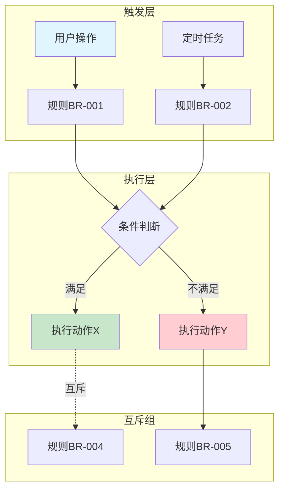
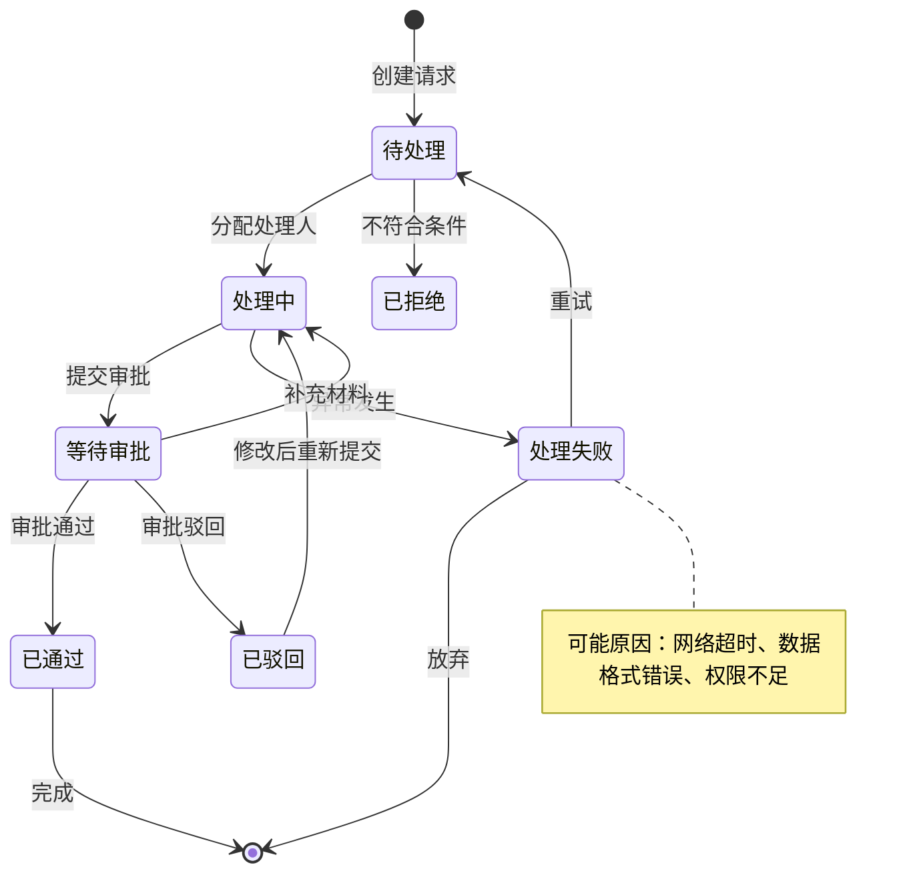
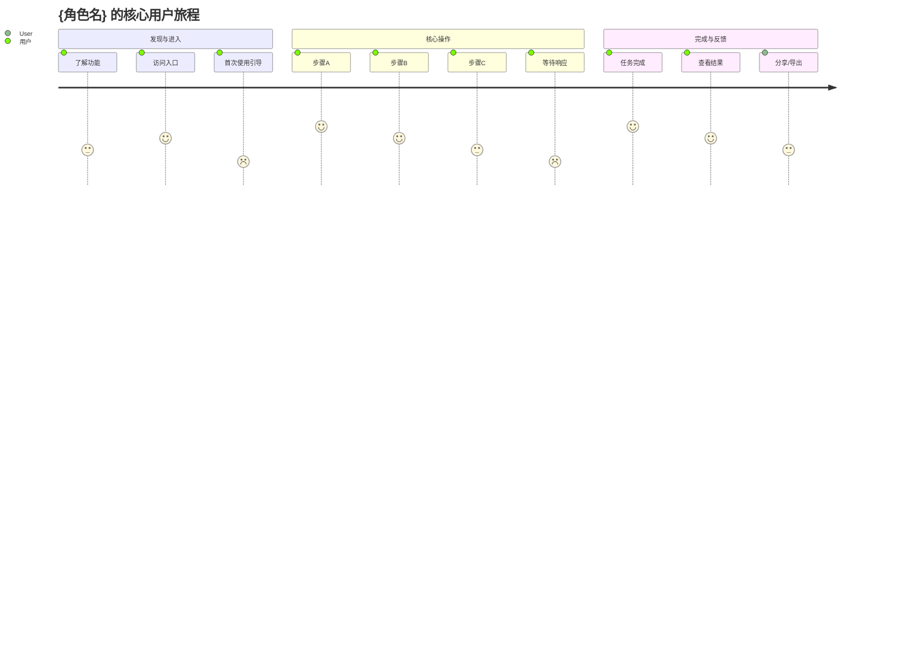
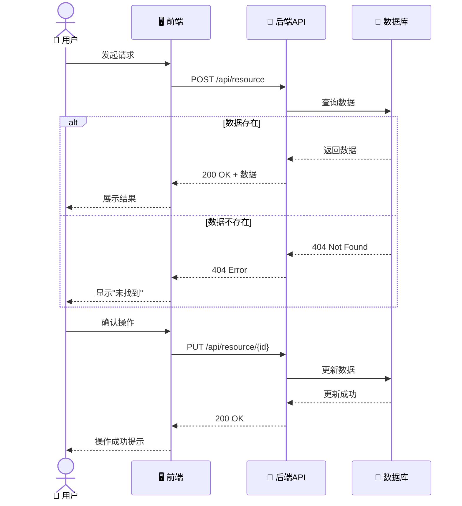
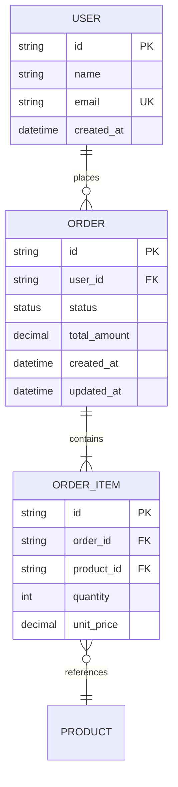

# Mermaid Charts Generator — Mermaid 图表生成器

> **所属 Capsule**: deep-requirements
> **生成器类型**: 产出物生成器 (Output Generator)
> **输入来源**: MODULE A (business-rules) + MODULE B (user-journey) + MODULE C (edge-cases)
> **输出格式**: Mermaid (.mmd)

## 生成器职责

根据分析模块的输出，生成各类 **Mermaid 可视化图表**，嵌入到 REQUIREMENTS.md 中或独立保存。

---

## 支持的图表类型

| 类型 | Mermaid 语法 | 来源模块 | 使用场景 |
|------|-------------|----------|----------|
| **流程图 (Flowchart)** | `graph TD/LR` | A, B, C | 规则依赖、审批流程、异常处理流 |
| **状态机 (State Diagram)** | `stateDiagram-v2` | B, C | 实体生命周期、订单状态、任务流转 |
| **旅程图 (Journey)** | `journey` | B | 用户情感体验地图 |
| **时序图 (Sequence)** | `sequenceDiagram` | B, C | API 调用时序、组件交互 |
| **ER 图 (ER Diagram)** | `erDiagram` | A, C | 数据模型关系 |

---

## 图表生成规则

### 1. 规则依赖关系图（graph TD）

**来源**: MODULE A - 业务规则的触发条件和依赖关系



**生成规则**:
- 使用 TD（Top-Down）布局
- 用 subgraph 分组（触发层、执行层、输出层）
- 互斥关系用虚线 `-.-` 表示
- 不同类型节点用不同颜色区分

---

### 2. 流程状态机（stateDiagram-v2）

**来源**: MODULE B - 用户旅程 + MODULE C - 异常处理



**生成规则**:
- 使用 v2 语法（支持 note）
- 包含所有主要状态和转换
- 标注关键异常状态的原因
- 循环/重试路径清晰展示

---

### 3. 用户旅程图（journey）

**来源**: MODULE B - 用户角色画像 + UJ-Q2 旅程路径



**生成规则**:
- 横轴为阶段，纵轴为步骤
- 评分 1-5（5=最佳体验）
- 明确标注低分环节（优化机会点）

---

### 4. 时序图（sequenceDiagram）

**来源**: MODULE B - 多角色交互 + MODULE C - 并发场景



**生成规则**:
- 使用 alt/opt/loop/par 控制流程
- 标注 HTTP 方法和状态码
- 清晰展示异步调用（如有）

---

### 5. ER 图（erDiagram）

**来源**: MODULE A - 业务实体 + MODULE C - 数据边界



**生成规则**:
- 标注 PK/FK/UK 约束
- 标注字段类型
- 展示 cardinality (||, o{|, |{)

---

## 输出规范

### 文件命名

| 图表类型 | 文件名示例 | 存放位置 |
|----------|------------|----------|
| 规则依赖图 | `rule-dependencies.mmd` | `.harness/diagrams/` |
| 状态机 | `{entity}-state-machine.mmd` | `.harness/diagrams/` |
| 旅程图 | `{role}-journey.mmd` | `.harness/diagrams/` |
| 时序图 | `{interaction}-sequence.mmd` | `.harness/diagrams/` |
| ER 图 | `{domain}-er-diagram.mmd` | `.harness/diagrams/` |

### 嵌入 REQUIREMENTS.md

在 REQUIREMENTS.md 中使用代码块嵌入：

````markdown
### 1.3 规则依赖关系图

```mermaid
{mermaid_code}
```
````

### 校验要求

- [ ] 所有图表可通过 [Mermaid Live Editor](https://mermaid.live) 渲染
- [ ] 无语法错误（标签匹配、箭头方向正确）
- [ ] 节点 ID 使用有效字符（不含特殊符号）
- [ ] 中文内容正常显示
