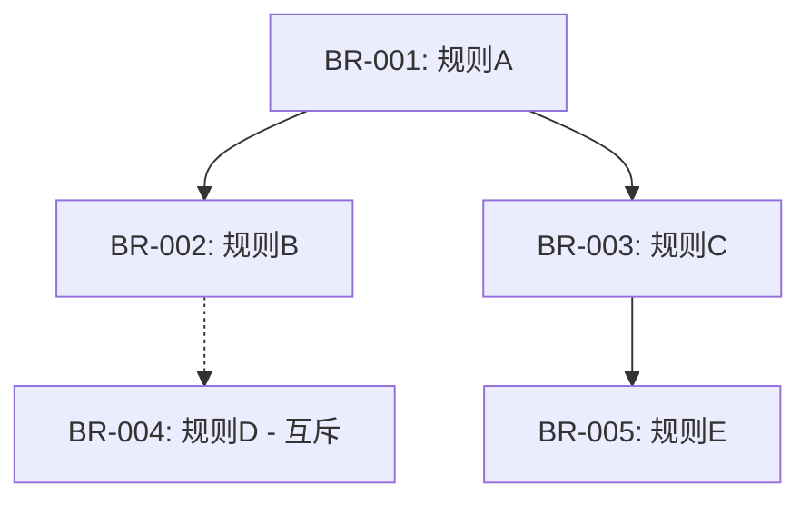

# Business Rules Analysis — 业务规则深度拆解模块

> **所属 Capsule**: deep-requirements
> **模块类型**: 分析模块 (Analysis Module)
> **问题数量**: 5 个深度采访问题
> **检查点类型**: TYPE_D (DEEP_INTERVIEW_CHECKPOINT)
> **输出格式**: 业务规则表 (Markdown Table)

## 模块职责

对用户需求进行**业务规则的逐层拆解**，遵循 **WHY → WHAT → HOW** 方法论：

| 层次 | 关注点 | 对应问题 | 产出 |
|------|--------|----------|------|
| **WHY** | 业务目标与价值 | BR-Q1 | 业务价值描述 |
| **WHAT** | 规则定义与复杂度 | BR-Q2 | 规则清单 |
| **WHEN** | 触发条件与依赖 | BR-Q3 | 触发矩阵 |
| **EXCEPTION** | 例外与边界 | BR-Q4 | 例外列表 |
| **STABILITY** | 变更频率 | BR-Q5 | 稳定性评级 |

---

## 执行流程

### 前置条件

- [ ] deep-requirements 主协调器已初始化
- [ ] `.harness/checkpoints/` 目录存在
- [ ] AskUserQuestion tool 可用

---

### 🔴 CHECKPOINT [DEEP-BR-Q1] — 业务目标与价值

```
检查点 ID: DEEP-BR-Q1
类型: TYPE_D (DEEP_INTERVIEW_CHECKPOINT)
阶段: Deep Requirements / Module A / Question 1 of 5
状态: ⏳ AWAITING_USER_INPUT
持久化: .harness/checkpoints/deep-br-q1.md
```

**Step 1.1**: 输出检查点标记
```
📍 CHECKPOINT [DEEP-BR-Q1] — 业务规则 Q1: 业务目标与价值
📊 进度: [█░░░░░░░░░] 8% (0/12 总体, 0/5 模块A)
```

**Step 1.2**: 调用 AskUserQuestion tool（强制，阻塞式）

```javascript
AskUserQuestion({
  questions: [{
    header: "BR-Q1: 目标",
    question: "这个功能要解决的核心业务问题是什么？请从业务价值角度描述（而非功能角度）。",
    options: [
      {
        label: "💰 收入增长",
        description: "直接或间接带来收入提升，如转化率、客单价、复购率等"
      },
      {
        label: "⚡ 效率提升",
        description: "减少人工操作、缩短流程时间、降低运营成本"
      },
      {
        label: "🛡️ 风险控制",
        description: "合规要求、安全加固、错误预防、审计追踪"
      },
      {
        label: "✏️ 自定义描述",
        description: "以上都不完全符合，我想详细说明业务目标"
      }
    ],
    multiSelect: false
  }]
})
```

**Step 1.3**: 🛑 BLOCK — 等待用户回复

**Step 1.4**: 收到回复后 → 持久化记录到 `.harness/checkpoints/deep-br-q1.md`

**Step 1.5**: 完成 → 进入 BR-Q2

---

### 🔴 CHECKPOINT [DEEP-BR-Q2] — 规则优先级与复杂度

```
检查点 ID: DEEP-BR-Q2
类型: TYPE_D (DEEP_INTERVIEW_CHECKPOINT)
前置条件: DEEP-BR-Q1 ✅ COMPLETED
持久化: .harness/checkpoints/deep-br-q2.md
```

**Step 2.1**: 输出标记
```
📍 CHECKPOINT [DEEP-BR-Q2] — 业务规则 Q2: 规则优先级与复杂度
📊 进度: [██░░░░░░░░] 17% (1/12 总体, 1/5 模块A)
```

**Step 2.2**: 调用 AskUserQuestion

```javascript
AskUserQuestion({
  questions: [{
    header: "BR-Q2: 规则",
    question: "这个功能涉及多少条独立的业务规则？规则的复杂程度如何？",
    options: [
      {
        label: "🟢 简单 (1-3 条规则)",
        description: "规则清晰明确，无复杂条件组合，如'金额必须大于0'"
      },
      {
        label: "🟡 中等 (4-8 条规则)",
        description: "有条件组合、状态依赖，如'VIP用户且订单满100元可免运费'"
      },
      {
        label: "🔴 复杂 (9+ 条规则)",
        description: "大量规则、动态配置、外部依赖，如电商促销引擎、风控系统"
      },
      {
        label: "✏️ 详细说明",
        description: "我想列举具体的业务规则"
      }
    ],
    multiSelect: false
  }]
})
```

**Step 2.3~2.5**: BLOCK → PERSIST → 进入 BR-Q3

---

### 🔴 CHECKPOINT [DEEP-BR-Q3] — 触发条件与依赖关系

```javascript
AskUserQuestion({
  questions: [{
    header: "BR-Q3: 触发",
    question: "这些业务规则在什么条件下被触发？是否存在规则间的依赖或互斥？",
    options: [
      { label: "📥 用户主动触发", description: "用户操作后执行，如表单提交、按钮点击" },
      { label: "⏰ 系统/定时触发", description: "定时任务、事件驱动、状态变化时自动执行" },
      { label: "🔗 混合触发 + 规则依赖", description: "多种触发方式，且规则间存在依赖/优先级/互斥关系" },
      { label: "✏️ 详细说明", description: "情况比较复杂，我想详细描述触发逻辑" }
    ],
    multiSelect: false
  }]
})
```

---

### 🔴 CHECKPOINT [DEEP-BR-Q4] — 例外与边界情况

```javascript
AskUserQuestion({
  questions: [{
    header: "BR-Q4: 例外",
    question: "这些业务规则是否有例外情况？哪些情况下规则不适用或有特殊处理？",
    options: [
      { label: "✅ 无例外", description: "规则适用于所有场景，无特殊情况" },
      { label: "⚠️ 少量例外 (1-3 个)", description: "有明确的例外场景，如特殊用户角色、测试环境、白名单" },
      { label: "🔄 动态例外", description: "例外情况可配置、可扩展，需要后台管理" },
      { label: "✏️ 详细说明", description: "我想列举具体的例外情况" }
    ],
    multiSelect: false
  }]
})
```

---

### 🔴 CHECKPOINT [DEEP-BR-Q5] — 规则稳定性与变更频率

```javascript
AskUserQuestion({
  questions: [{
    header: "BR-Q5: 稳定性",
    question: "这些业务规则预计多长时间会变更一次？是否需要支持运行时配置？",
    options: [
      { label: "🪨 高稳定 (半年+不变)", description: "规则固定，硬编码即可，如物理公式、法律条款" },
      { label: "📅 中等稳定 (月度/季度调整)", description: "偶尔调整，可通过配置文件或数据库管理" },
      { label: "⚡ 高频变更 (周/日级别)", description: "运营人员频繁调整，需要规则引擎或后台配置界面" },
      { label: "✏️ 详细说明", description: "不同规则有不同的变更频率" }
    ],
    multiSelect: false
  }]
})
```

---

## 产出物：业务规则表模板

当 BR-Q1 ~ BR-Q5 全部完成后，生成以下格式的业务规则表：

```markdown
# 业务规则深度拆解结果

## 核心业务目标
- **业务价值**: {来自 BR-Q1}
- **成功指标**: {来自 UJ-Q4}

## 业务规则表

| 规则ID | 规则名称 | 描述 (WHAT) | 触发条件 (WHEN) | 例外情况 | 优先级 | 稳定性 |
|--------|----------|-------------|------------------|----------|--------|--------|
| BR-001 | {规则名} | {规则描述} | {触发条件} | {例外} | P0/P1/P2 | 高/中/低 |
| BR-002 | ... | ... | ... | ... | ... | ... |

## 规则依赖关系图



## 规则属性汇总

| 属性 | 值 |
|------|-----|
| 总规则数 | {N} 条 |
| P0 (关键) | {n} 条 |
| P1 (重要) | {n} 条 |
| P2 (一般) | {n} 条 |
| 高稳定性 | {n} 条 |
| 中等稳定 | {n} 条 |
| 高频变更 | {n} 条 |
```

---

## 完成标志

- [ ] DEEP-BR-Q1: ✅ COMPLETED
- [ ] DEEP-BR-Q2: ✅ COMPLETED
- [ ] DEEP-BR-Q3: ✅ COMPLETED
- [ ] DEEP-BR-Q4: ✅ COMPLETED
- [ ] DEEP-BR-Q5: ✅ COMPLETED
- [ ] 业务规则表已生成

**全部完成 → 返回主协调器 → 进入 MODULE B: user-journey**

## 失败处理

| 失败场景 | 处理方式 | 恢复策略 |
|---------|---------|---------|
| 业务规则相互矛盾 | 标注矛盾并提交决策 | 确认优先级后重新整理 |
| 规则描述模糊 | 追问具体条件和边界 | 补充细节后重新记录 |
| 规则数量过多 | 按优先级分组，先处理核心规则 | 分批处理后合并 |
