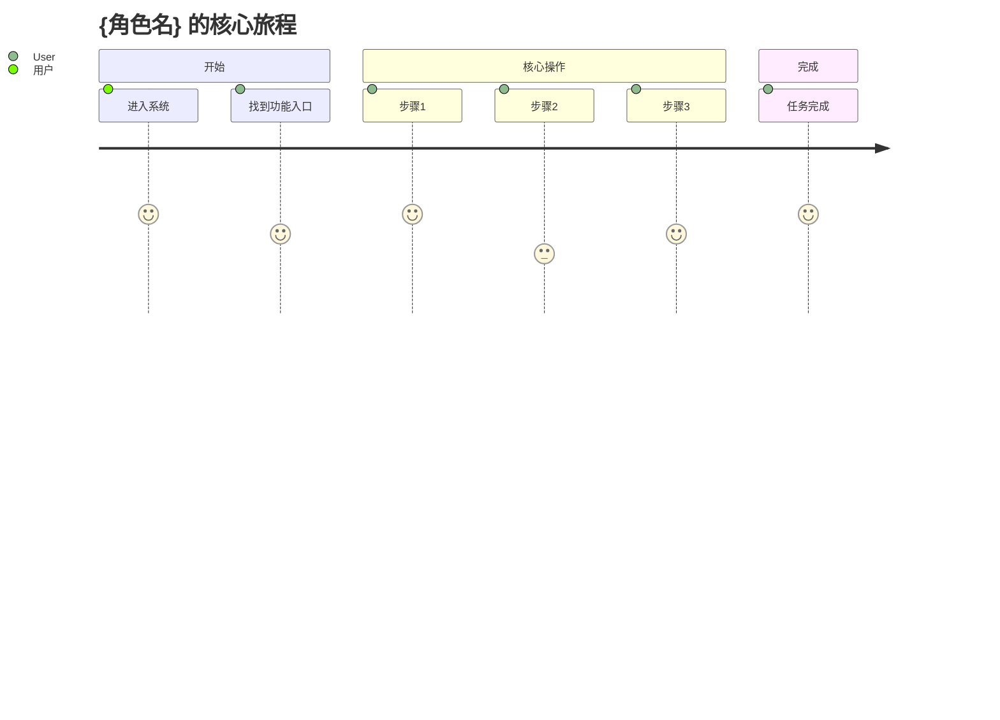
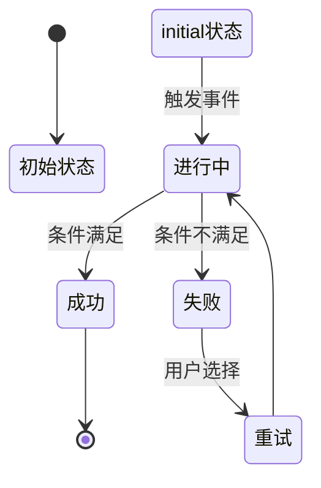

# User Journey Analysis — 用户旅程分析模块

> **所属 Capsule**: deep-requirements
> **模块类型**: 分析模块 (Analysis Module)
> **问题数量**: 4 个深度采访问题
> **检查点类型**: TYPE_D (DEEP_INTERVIEW_CHECKPOINT)
> **输出格式**: 用户角色画像表 + Mermaid 旅程图 + 状态机图

## 模块职责

对用户需求进行**用户旅程的深度分析**，识别用户角色、核心路径、痛点和成功指标：

| 维度 | 关注点 | 对应问题 | 产出 |
|------|--------|----------|------|
| **WHO** | 用户角色与权限 | UJ-Q1 | 角色画像表 |
| **HOW** | 完整任务流程 | UJ-Q2 | Mermaid 旅程图 + 状态机 |
| **PAIN** | 现有痛点与机会 | UJ-Q3 | 痛点清单 |
| **SUCCESS** | 成功衡量标准 | UJ-Q4 | KPI 指标 |

---

## 执行流程

### 前置条件

- [ ] MODULE A (business-rules) 已完成
- [ ] deep-requirements 主协调器已传递控制权
- [ ] `.harness/checkpoints/` 目录存在

---

### 🔴 CHECKPOINT [DEEP-UJ-Q1] — 用户角色识别

```
检查点 ID: DEEP-UJ-Q1
类型: TYPE_D (DEEP_INTERVIEW_CHECKPOINT)
阶段: Deep Requirements / Module B / Question 1 of 4
持久化: .harness/checkpoints/deep-uj-q1.md
```

**Step 1.1**: 输出标记
```
📍 CHECKPOINT [DEEP-UJ-Q1] — 用户旅程 Q1: 用户角色识别
📊 进度: [███████░░░░░] 50% (5/12 总体, 0/4 模块B)
```

**Step 1.2**: 调用 AskUserQuestion

```javascript
AskUserQuestion({
  questions: [{
    header: "UJ-Q1: 角色",
    question: "这个功能涉及哪些不同的用户角色？每个角色的权限和目标有何不同？",
    options: [
      {
        label: "👤 单一角色",
        description: "所有用户使用相同的功能和流程"
      },
      {
        label: "👥 2-3 个角色",
        description: "如普通用户/管理员、买家/卖家、员工/经理"
      },
      {
        label: "👨‍👩‍👧‍👦 4+ 个角色",
        description: "复杂角色体系，可能有角色继承、动态权限"
      },
      {
        label: "✏️ 详细说明",
        description: "我想列出所有角色及其职责"
      }
    ],
    multiSelect: false
  }]
})
```

**Step 1.3~1.5**: BLOCK → PERSIST → 进入 UJ-Q2

---

### 🔴 CHECKPOINT [DEEP-UJ-Q2] — 核心旅程路径

```javascript
AskUserQuestion({
  questions: [{
    header: "UJ-Q2: 旅程",
    question: "描述一个用户完成核心任务的完整步骤（从开始到结束）。哪个环节最关键？",
    options: [
      { label: "📍 线性流程", description: "步骤1→步骤2→步骤3→完成，无分支" },
      { label: "🔀 有条件分支", description: "根据用户选择或条件走不同路径，但最终汇聚" },
      { label: "🌀 复杂网络", description: "多起点、多终点、循环、回退、并行路径" },
      { label": "✏️ 详细描述", description: "我想画出或描述完整的用户旅程" }
    ],
    multiSelect: false
  }]
})
```

---

### 🔴 CHECKPOINT [DEEP-UJ-Q3] — 痛点与机会

```javascript
AskUserQuestion({
  questions: [{
    header: "UJ-Q3: 痛点",
    question: "现有解决方案（如果有）的主要痛点是什么？新功能如何解决这些痛点？",
    options: [
      { label: "🆕 全新功能", description: "没有现有方案，这是从零开始的新能力" },
      { label: "🔧 替换旧系统", description: "替代现有的手工流程或老旧系统" },
      { label: "📈 增强现有功能", description: "在现有基础上增加新能力或优化体验" },
      { label: "✏️ 详细说明", description: "我想描述具体痛点和改进方向" }
    ],
    multiSelect: false
  }]
})
```

---

### 🔴 CHECKPOINT [DEEP-UJ-Q4] — 成功指标

```javascript
AskUserQuestion({
  questions: [{
    header: "UJ-Q4: 指标",
    question: "如何衡量这个功能的成功？有哪些关键指标（KPI）？",
    options: [
      { label: "🎯 功能可用性", description: "功能能正常工作，无明显 Bug" },
      { label: "📊 业务指标", description: "如转化率、留存率、使用时长、任务完成率" },
      { label: "⭐ 用户体验", description: "NPS、满意度评分、任务完成时间、错误率" },
      { label: "✏️ 自定义指标", description: "我有特定的成功标准" }
    ],
    multiSelect: false
  }]
})
```

---

## 产出物：用户旅程分析模板

### 1. 用户角色画像表

```markdown
## 用户角色画像

| 角色 | 目标 | 权限 | 核心场景 | 痛点 | 成功指标 |
|------|------|------|----------|------|----------|
| {角色A} | {目标} | {权限} | {场景} | {痛点} | {KPI} |
| {角色B} | ... | ... | ... | ... | ... |
```

### 2. Mermaid 用户旅程图



### 3. Mermaid 状态机图



---

## 完成标志

- [ ] DEEP-UJ-Q1: ✅ COMPLETED
- [ ] DEEP-UJ-Q2: ✅ COMPLETED
- [ ] DEEP-UJ-Q3: ✅ COMPLETED
- [ ] DEEP-UJ-Q4: ✅ COMPLETED
- [ ] 用户角色画像表已生成
- [ ] Mermaid 旅程图已生成
- [ ] Mermaid 状态机图已生成

**全部完成 → 返回主协调器 → 进入 MODULE C: edge-cases**

## 失败处理

| 失败场景 | 处理方式 | 恢复策略 |
|---------|---------|---------|
| 用户角色不明确 | 使用默认角色模板辅助定义 | 明确角色后重新分析 |
| 旅程步骤断裂 | 标注断裂点，追问缺失步骤 | 补充步骤后重新串联 |
| 异常路径遗漏 | 提供常见异常路径清单 | 参考清单补充后重新分析 |
